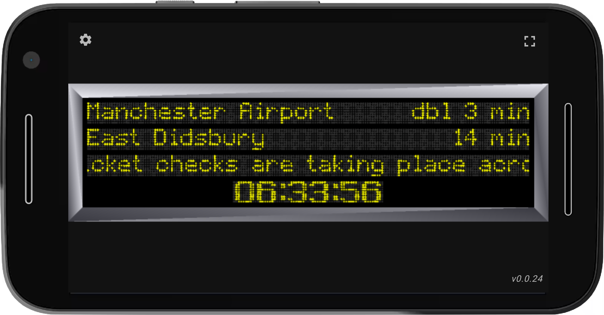
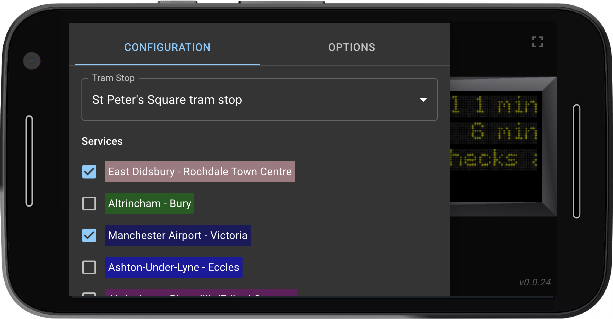

# TfGM Platform Display

A web app that simulates a Metrolink platform dot-matrix display. It renders a LED-style sign with animated scrolling text, alternating messages, and a live clock, driven by real-time tram arrival data from the TfGM API.

## Description

The display shows up to three rows of tram information plus a clock:

- **Row 1** — the next tram due at the configured stop
- **Row 2** — additional trams (scrolling through them when there is more than one)
- **Row 3** — a static alert message
- **Row 4** — the current time, with a blinking colon

Each row is drawn as a grid of illuminated dots using [Phaser](https://phaser.io), with custom dot-matrix fonts. Text can be left-aligned, centred, or split across the row (`spaceBetween`), and approaching trams alternate between destination and status. The alert row scrolls horizontally. When tram data changes, rows fade out and scroll vertically into the new content.

The React shell handles configuration and data fetching. A side panel lets you choose a tram stop (ATCO code), which Metrolink lines to show, and direction of travel (towards the start or end of the line). Tram data is polled from a TfGM API on a configurable refresh interval; a subtle border shine animation indicates when a fetch is in progress.

For development and demos, append `?testMode=1`–`4` to the URL to load canned tram data instead of calling the live API.

Built with:

* React
* TypeScript
* Vite
* Material UI
* TanStack Query
* Phaser 4

Deployed to GitHub Pages [here](https://taylorjg.github.io/tfgm-platform-display).

# Screenshots

# To Do

* [ ] Use the API to determine the most appropriate alert text (currently, it is hardcoded)
* [x] Network requests: add error handling / surface errors
* [ ] Show an empty block when no tram stop has been configured yet
* [ ] Support saving of named configurations
* [ ] Support quickly selecting a named configuration
* [ ] Save configurations and options in local storage
* [ ] Show the currently selected tram stop / configuration
* [ ] Refactoring / code improvements
* [x] Add unit tests
* [ ] Add integration tests
* [x] Add CI/CD GitHub Actions workflow

# Links

* Test modes - hardcoded data with fictitious names:
  * [Test mode 1](https://taylorjg.github.io/tfgm-platform-display?testMode=1)
  * [Test mode 2](https://taylorjg.github.io/tfgm-platform-display?testMode=2)
  * [Test mode 3](https://taylorjg.github.io/tfgm-platform-display?testMode=3)
  * [Test mode 4](https://taylorjg.github.io/tfgm-platform-display?testMode=4)
* Transport for Greater Manchester (TfGM):
  * [Bee Network | Powered by TfGM](https://tfgm.com/)
  * [Live departures | Bee Network | Powered by TfGM](https://tfgm.com/travel-updates/live-departures)
  * https://beenetwork-staging.api-tf.tfgm.com
* ATCO Codes
  * [ATCO Area Codes in use](https://beta-naptan.dft.gov.uk/article/atco-codes-in-use)
    * See `940 - Tram (National) - DfT`
  * [NaPTAN guide for data managers](https://www.gov.uk/government/publications/national-public-transport-access-node-schema/naptan-guide-for-data-managers)
  * [NaPTAN API](https://naptan.api.dft.gov.uk/swagger/index.html)
* Phaser:  
  * [Phaser](https://phaser.io)
  * [Phaser Docs](https://docs.phaser.io)
* Backend repo:
  * [Repo for AWS Lambda Functions](https://github.com/taylorjg/sls4-test)
  * [Serverless Framework](https://www.serverless.com)
